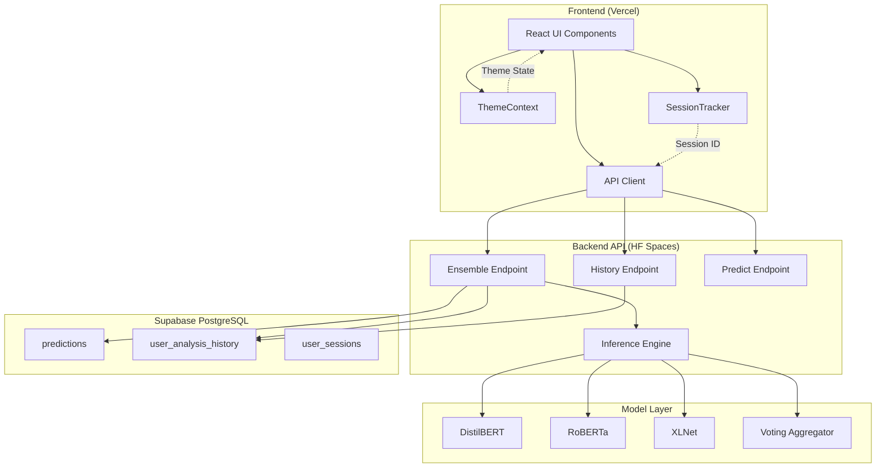
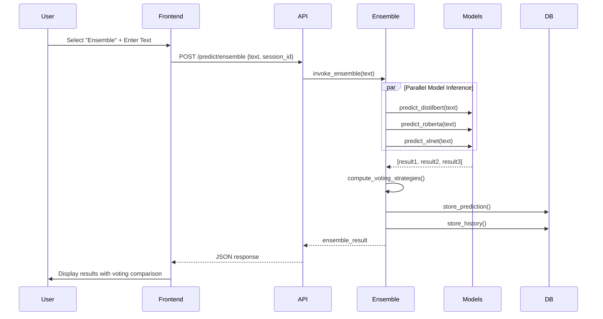
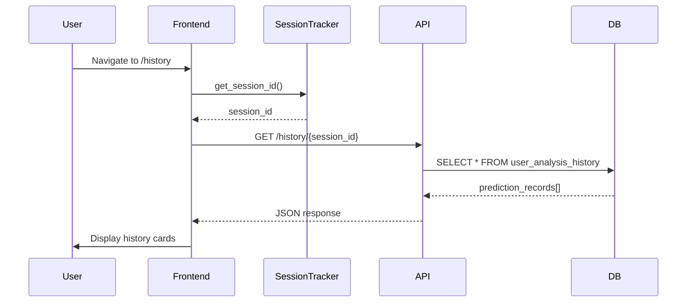

# Design Document: Phase 1 Enhancements

## Overview

This design document specifies the technical architecture and implementation details for three major enhancements to the VeracityLens fake news detection system:

1. **Ensemble Model**: A meta-classifier that combines predictions from DistilBERT, RoBERTa, and XLNet using multiple voting strategies (hard, soft, and weighted voting)
2. **User Analysis History**: Session-based tracking and persistent storage of user predictions with retrieval capabilities
3. **Dark Mode**: A complete theme system with light/dark mode toggle using React Context and Tailwind CSS

All features are designed to operate within free-tier infrastructure constraints (HuggingFace Spaces CPU-only, Supabase 500MB limit, Vercel free tier).

### Design Goals

- Improve prediction accuracy through ensemble methods
- Enhance user experience with prediction history tracking
- Provide accessibility through dark mode support
- Maintain zero-cost operation within free tier limits
- Ensure backward compatibility with existing API and frontend

### Technology Stack

- **Backend**: FastAPI (Python 3.10+), HuggingFace Transformers, asyncio
- **Frontend**: React 18, Vite, Tailwind CSS, Framer Motion, React Router
- **Database**: Supabase (PostgreSQL 14)
- **Deployment**: HuggingFace Spaces (backend), Vercel (frontend)

## Architecture

### System Architecture



### Component Interaction Flow

#### Ensemble Prediction Flow



#### History Retrieval Flow



## Components and Interfaces

### Backend Components

#### 1. Ensemble Model Inference Engine

**Location**: `fake-news-api/src/models/ensemble.py`

**Purpose**: Orchestrates parallel inference across all three models and aggregates results using multiple voting strategies.

**Key Classes**:

```python
class EnsembleClassifier:
    """
    Combines predictions from DistilBERT, RoBERTa, and XLNet using voting strategies.
    """

    def __init__(self):
        self.models = {
            'distilbert': get_classifier('distilbert'),
            'roberta': get_classifier('roberta'),
            'xlnet': get_classifier('xlnet')
        }
        self.weights = {
            'distilbert': 0.859,
            'roberta': 0.858,
            'xlnet': 0.862
        }

    async def predict_ensemble(self, text: str) -> EnsembleResult:
        """
        Run all three models in parallel and aggregate results.

        Args:
            text: Input text to classify

        Returns:
            EnsembleResult containing all voting strategies and individual predictions
        """
        pass

    def hard_voting(self, predictions: List[Dict]) -> str:
        """Select label with most votes (mode)."""
        pass

    def soft_voting(self, predictions: List[Dict]) -> Dict[str, float]:
        """Average probability scores across models."""
        pass

    def weighted_voting(self, predictions: List[Dict]) -> Dict[str, float]:
        """Apply accuracy weights before averaging."""
        pass
```

**Data Structures**:

```python
@dataclass
class EnsembleResult:
    hard_voting_label: str
    hard_voting_confidence: float
    soft_voting_label: str
    soft_voting_confidence: float
    soft_voting_scores: Dict[str, float]
    weighted_voting_label: str
    weighted_voting_confidence: float
    weighted_voting_scores: Dict[str, float]
    individual_predictions: List[ModelPrediction]
    merged_explanation: List[TokenImportance]
    execution_time_ms: float

@dataclass
class ModelPrediction:
    model_name: str
    label: str
    confidence: float
    scores: Dict[str, float]
    tokens: List[TokenImportance]
```

**Parallel Execution Strategy**:

```python
async def predict_ensemble(self, text: str) -> EnsembleResult:
    loop = asyncio.get_event_loop()

    # Execute all models in parallel using ThreadPoolExecutor
    tasks = [
        loop.run_in_executor(None, self.models[name].predict, text)
        for name in ['distilbert', 'roberta', 'xlnet']
    ]

    try:
        results = await asyncio.gather(*tasks, return_exceptions=True)
        # Handle partial failures gracefully
        valid_results = [r for r in results if not isinstance(r, Exception)]

        if len(valid_results) == 0:
            raise RuntimeError("All models failed")

        # Compute voting strategies
        hard_label = self.hard_voting(valid_results)
        soft_scores = self.soft_voting(valid_results)
        weighted_scores = self.weighted_voting(valid_results)

        return EnsembleResult(...)
    except Exception as e:
        # Log and re-raise
        raise
```

#### 2. Ensemble API Endpoint

**Location**: `fake-news-api/src/api/main.py`

**Endpoint**: `POST /predict/ensemble`

**Request Schema**:

```python
class EnsemblePredictionRequest(BaseModel):
    text: str
    session_id: Optional[str] = None

    @validator('text')
    def validate_text(cls, v):
        if len(v.strip()) < 10:
            raise ValueError("Text too short to classify")
        return v
```

**Response Schema**:

```python
class EnsemblePredictionResponse(BaseModel):
    article_id: str
    primary_prediction: PredictionSummary  # hard voting result
    voting_strategies: VotingStrategies
    individual_models: List[ModelPrediction]
    merged_explanation: List[TokenImportance]
    execution_time_ms: float
    warnings: Optional[List[str]] = None  # e.g., "roberta failed"

class VotingStrategies(BaseModel):
    hard_voting: VotingResult
    soft_voting: VotingResult
    weighted_voting: VotingResult

class VotingResult(BaseModel):
    label: str
    confidence: float
    scores: Dict[str, float]
```

**Implementation**:

```python
@app.post("/predict/ensemble", response_model=EnsemblePredictionResponse)
async def predict_ensemble(
    request: EnsemblePredictionRequest,
    background_tasks: BackgroundTasks,
    x_session_id: Optional[str] = Header(None)
):
    """
    Run ensemble prediction using all three models.
    Stores results in both predictions and user_analysis_history tables.
    """
    article_id = str(uuid.uuid4())
    session_id = x_session_id or request.session_id

    try:
        ensemble = get_ensemble_classifier()
        result = await ensemble.predict_ensemble(request.text)

        response = EnsemblePredictionResponse(
            article_id=article_id,
            primary_prediction=result.hard_voting_result,
            voting_strategies=result.voting_strategies,
            individual_models=result.individual_predictions,
            merged_explanation=result.merged_explanation,
            execution_time_ms=result.execution_time_ms,
            warnings=result.warnings
        )

        # Background task: store to database
        background_tasks.add_task(
            store_ensemble_prediction,
            article_id=article_id,
            session_id=session_id,
            text=request.text,
            result=result
        )

        return response

    except asyncio.TimeoutError:
        raise HTTPException(status_code=504, detail="Ensemble prediction timed out")
    except Exception as e:
        logger.error(f"Ensemble prediction failed: {e}")
        raise HTTPException(status_code=500, detail=str(e))
```

#### 3. User History Storage

**Location**: `fake-news-api/src/utils/supabase_client.py`

**New Methods**:

```python
class SupabaseClient:

    def store_user_history(
        self,
        session_id: str,
        article_id: str,
        text: str,
        predicted_label: str,
        confidence: float,
        model_name: str
    ) -> Dict[str, Any]:
        """
        Store prediction in user_analysis_history table.

        Args:
            session_id: UUID v4 session identifier
            article_id: Unique article identifier
            text: Full article text (will be truncated to 200 chars for preview)
            predicted_label: One of True/Fake/Satire/Bias
            confidence: Float between 0.0 and 1.0
            model_name: Model identifier (distilbert/roberta/xlnet/ensemble)

        Returns:
            Inserted record data
        """
        data = {
            "session_id": session_id,
            "article_id": article_id,
            "text_preview": text[:200],
            "predicted_label": predicted_label,
            "confidence": confidence,
            "model_name": model_name,
            "created_at": datetime.utcnow().isoformat()
        }
        response = self.client.table("user_analysis_history").insert(data).execute()
        return response.data

    def get_user_history(
        self,
        session_id: str,
        limit: int = 100
    ) -> List[Dict[str, Any]]:
        """
        Retrieve user's prediction history ordered by most recent first.

        Args:
            session_id: UUID v4 session identifier
            limit: Maximum number of records to return (default 100)

        Returns:
            List of prediction records
        """
        response = (
            self.client.table("user_analysis_history")
            .select("*")
            .eq("session_id", session_id)
            .order("created_at", desc=True)
            .limit(limit)
            .execute()
        )
        return response.data
```

#### 4. History API Endpoint

**Location**: `fake-news-api/src/api/main.py`

**Endpoint**: `GET /history/{session_id}`

**Implementation**:

```python
@app.get("/history/{session_id}")
async def get_user_history(
    session_id: str,
    limit: int = Query(100, ge=1, le=100)
):
    """
    Retrieve user's analysis history by session ID.

    Args:
        session_id: UUID v4 session identifier
        limit: Maximum records to return (1-100)

    Returns:
        List of prediction records with metadata
    """
    # Validate UUID format
    try:
        uuid.UUID(session_id)
    except ValueError:
        raise HTTPException(
            status_code=400,
            detail="Invalid session ID format"
        )

    try:
        supabase = get_supabase_client()
        history = supabase.get_user_history(session_id, limit)

        return {
            "status": "success",
            "session_id": session_id,
            "count": len(history),
            "history": history
        }
    except Exception as e:
        logger.error(f"Failed to fetch history: {e}")
        raise HTTPException(
            status_code=500,
            detail="Failed to load history"
        )
```

### Frontend Components

#### 1. Session Tracker

**Location**: `frontend/src/utils/sessionTracker.js`

**Purpose**: Manage browser session identification using localStorage.

**Implementation**:

```javascript
import { v4 as uuidv4 } from "uuid";

const SESSION_KEY = "veracitylens_session_id";

export class SessionTracker {
  constructor() {
    this.sessionId = this.initializeSession();
  }

  initializeSession() {
    try {
      // Try to retrieve existing session
      let sessionId = localStorage.getItem(SESSION_KEY);

      if (!sessionId) {
        // Generate new UUID v4
        sessionId = uuidv4();
        localStorage.setItem(SESSION_KEY, sessionId);
      }

      return sessionId;
    } catch (error) {
      // localStorage unavailable (private browsing, etc.)
      console.warn("localStorage unavailable, using temporary session");
      return uuidv4();
    }
  }

  getSessionId() {
    return this.sessionId;
  }

  resetSession() {
    const newId = uuidv4();
    try {
      localStorage.setItem(SESSION_KEY, newId);
    } catch (error) {
      console.warn("Failed to persist new session ID");
    }
    this.sessionId = newId;
    return newId;
  }
}

// Singleton instance
export const sessionTracker = new SessionTracker();
```

#### 2. Enhanced API Client

**Location**: `frontend/src/services/api.js`

**New Functions**:

```javascript
import { sessionTracker } from "../utils/sessionTracker";

// Add session ID to all requests
client.interceptors.request.use((config) => {
  config.headers["X-Session-ID"] = sessionTracker.getSessionId();
  return config;
});

/** Analyze with ensemble model */
export async function analyzeEnsemble(text) {
  const { data } = await client.post("/predict/ensemble", { text });
  return data;
}

/** Get user's analysis history */
export async function getUserHistory(sessionId, limit = 100) {
  const { data } = await client.get(`/history/${sessionId}`, {
    params: { limit },
  });
  return data;
}
```

#### 3. Theme Context Provider

**Location**: `frontend/src/contexts/ThemeContext.jsx`

**Purpose**: Manage application theme state (light/dark) with persistence.

**Implementation**:

```javascript
import React, { createContext, useContext, useState, useEffect } from "react";

const ThemeContext = createContext();

const THEME_KEY = "veracitylens_theme";
const THEMES = {
  LIGHT: "light",
  DARK: "dark",
};

export function ThemeProvider({ children }) {
  const [theme, setTheme] = useState(() => {
    // Initialize from localStorage or system preference
    try {
      const saved = localStorage.getItem(THEME_KEY);
      if (saved && (saved === THEMES.LIGHT || saved === THEMES.DARK)) {
        return saved;
      }
    } catch (error) {
      console.warn("localStorage unavailable for theme");
    }

    // Check system preference
    if (window.matchMedia("(prefers-color-scheme: dark)").matches) {
      return THEMES.DARK;
    }

    return THEMES.LIGHT;
  });

  useEffect(() => {
    // Apply theme to document root
    const root = document.documentElement;

    if (theme === THEMES.DARK) {
      root.classList.add("dark");
    } else {
      root.classList.remove("dark");
    }

    // Persist to localStorage
    try {
      localStorage.setItem(THEME_KEY, theme);
    } catch (error) {
      console.warn("Failed to persist theme preference");
    }
  }, [theme]);

  const toggleTheme = () => {
    setTheme((prev) => (prev === THEMES.LIGHT ? THEMES.DARK : THEMES.LIGHT));
  };

  const value = {
    theme,
    isDark: theme === THEMES.DARK,
    toggleTheme,
  };

  return (
    <ThemeContext.Provider value={value}>{children}</ThemeContext.Provider>
  );
}

export function useTheme() {
  const context = useContext(ThemeContext);
  if (!context) {
    throw new Error("useTheme must be used within ThemeProvider");
  }
  return context;
}
```

#### 4. Enhanced Model Selector

**Location**: `frontend/src/components/ModelSelector.jsx`

**Changes**: Add "Ensemble" option to existing model list.

```javascript
const MODELS = [
  {
    id: "ensemble",
    label: "Ensemble",
    desc: "All 3 Models · Most Accurate",
    badge: "Best",
  },
  {
    id: "distilbert",
    label: "DistilBERT",
    desc: "66M · Fast",
    badge: null,
  },
  {
    id: "roberta",
    label: "RoBERTa",
    desc: "125M · Accurate",
    badge: null,
  },
  {
    id: "xlnet",
    label: "XLNet",
    desc: "110M · Context-aware",
    badge: null,
  },
];
```

#### 5. Enhanced Result Card

**Location**: `frontend/src/components/ResultCard.jsx`

**Changes**: Add support for displaying ensemble results with voting comparison.

```javascript
function EnsembleResultView({ result }) {
  const [showDetails, setShowDetails] = useState(false);

  return (
    <div className="space-y-4">
      {/* Primary prediction (hard voting) */}
      <div className="...">
        <h4>Ensemble Prediction (Hard Voting)</h4>
        <PredictionDisplay prediction={result.primary_prediction} />
      </div>

      {/* Voting strategies comparison */}
      <button onClick={() => setShowDetails(!showDetails)} className="...">
        {showDetails ? "Hide" : "Show"} Voting Strategies
      </button>

      {showDetails && (
        <div className="space-y-3">
          <VotingStrategyCard
            name="Hard Voting"
            description="Majority vote from all models"
            result={result.voting_strategies.hard_voting}
          />
          <VotingStrategyCard
            name="Soft Voting"
            description="Average probability scores"
            result={result.voting_strategies.soft_voting}
          />
          <VotingStrategyCard
            name="Weighted Voting"
            description="Accuracy-weighted average"
            result={result.voting_strategies.weighted_voting}
          />
        </div>
      )}

      {/* Individual model predictions */}
      <div className="...">
        <h4>Individual Model Predictions</h4>
        {result.individual_models.map((model) => (
          <ModelPredictionCard key={model.model_name} prediction={model} />
        ))}
      </div>
    </div>
  );
}
```

#### 6. History Page Component

**Location**: `frontend/src/pages/HistoryPage.jsx`

**Purpose**: Display user's analysis history with navigation back to analysis.

**Implementation**:

```javascript
import React, { useState, useEffect } from "react";
import { useNavigate } from "react-router-dom";
import { getUserHistory } from "../services/api";
import { sessionTracker } from "../utils/sessionTracker";
import { Clock, TrendingUp } from "lucide-react";

export default function HistoryPage() {
  const navigate = useNavigate();
  const [history, setHistory] = useState([]);
  const [loading, setLoading] = useState(true);
  const [error, setError] = useState(null);

  useEffect(() => {
    loadHistory();
  }, []);

  const loadHistory = async () => {
    setLoading(true);
    setError(null);

    try {
      const sessionId = sessionTracker.getSessionId();
      const data = await getUserHistory(sessionId);
      setHistory(data.history || []);
    } catch (err) {
      setError("Failed to load history. Please try again.");
    } finally {
      setLoading(false);
    }
  };

  const handleItemClick = (item) => {
    // Navigate to home with pre-filled text
    navigate("/", {
      state: {
        prefill: item.text_preview,
        articleId: item.article_id,
      },
    });
  };

  if (loading) {
    return <LoadingHistorySkeleton />;
  }

  if (error) {
    return (
      <div className="max-w-5xl mx-auto px-4 py-10">
        <ErrorMessage message={error} onRetry={loadHistory} />
      </div>
    );
  }

  if (history.length === 0) {
    return (
      <div className="max-w-5xl mx-auto px-4 py-10 text-center">
        <Clock className="w-16 h-16 text-gray-300 mx-auto mb-4" />
        <h2 className="text-xl font-semibold text-gray-700 mb-2">
          No analysis history yet
        </h2>
        <p className="text-gray-500 mb-6">
          Start analyzing news articles to build your history.
        </p>
        <button
          onClick={() => navigate("/")}
          className="px-6 py-3 bg-[#d97757] text-white rounded-lg hover:bg-[#c4623e]"
        >
          Analyze Your First Article
        </button>
      </div>
    );
  }

  return (
    <div className="max-w-5xl mx-auto px-4 py-10">
      <div className="mb-8">
        <h1 className="text-3xl font-bold text-gray-900 dark:text-gray-100 mb-2">
          Analysis History
        </h1>
        <p className="text-gray-600 dark:text-gray-400">
          {history.length} prediction{history.length !== 1 ? "s" : ""} in your
          history
        </p>
      </div>

      <div className="space-y-4">
        {history.map((item) => (
          <HistoryCard
            key={item.article_id}
            item={item}
            onClick={() => handleItemClick(item)}
          />
        ))}
      </div>
    </div>
  );
}

function HistoryCard({ item, onClick }) {
  const config = CONFIG[item.predicted_label] || CONFIG.True;
  const Icon = config.icon;

  return (
    <motion.div
      whileHover={{ scale: 1.01 }}
      onClick={onClick}
      className="bg-white dark:bg-gray-800 border border-gray-200 dark:border-gray-700 rounded-xl p-5 cursor-pointer hover:shadow-md transition-all"
    >
      <div className="flex items-start justify-between gap-4">
        <div className="flex-1">
          <div className="flex items-center gap-3 mb-2">
            <div
              className="w-8 h-8 rounded-lg flex items-center justify-center"
              style={{ backgroundColor: `${config.color}18` }}
            >
              <Icon className="w-4 h-4" style={{ color: config.color }} />
            </div>
            <span
              className={`text-xs font-medium px-2 py-1 rounded-full ${config.badge}`}
            >
              {item.predicted_label}
            </span>
            <span className="text-xs text-gray-500 dark:text-gray-400">
              {item.model_name}
            </span>
          </div>

          <p className="text-sm text-gray-700 dark:text-gray-300 line-clamp-2 mb-2">
            {item.text_preview}
          </p>

          <div className="flex items-center gap-4 text-xs text-gray-500 dark:text-gray-400">
            <span className="flex items-center gap-1">
              <TrendingUp className="w-3 h-3" />
              {Math.round(item.confidence * 100)}% confidence
            </span>
            <span className="flex items-center gap-1">
              <Clock className="w-3 h-3" />
              {new Date(item.created_at).toLocaleDateString()}
            </span>
          </div>
        </div>
      </div>
    </motion.div>
  );
}
```

#### 7. Theme Toggle Button

**Location**: `frontend/src/components/Header.jsx`

**Changes**: Add theme toggle button to header.

```javascript
import { Moon, Sun } from "lucide-react";
import { useTheme } from "../contexts/ThemeContext";

export default function Header() {
  const { isDark, toggleTheme } = useTheme();

  return (
    <header className="...">
      <div className="...">
        {/* Existing logo and nav */}

        {/* Theme toggle */}
        <button
          onClick={toggleTheme}
          aria-label={isDark ? "Switch to light mode" : "Switch to dark mode"}
          className="p-2 text-gray-600 dark:text-gray-300 hover:bg-gray-100 dark:hover:bg-gray-800 rounded-lg transition-all"
          title={isDark ? "Switch to light mode" : "Switch to dark mode"}
        >
          <motion.div
            initial={false}
            animate={{ rotate: isDark ? 180 : 0 }}
            transition={{ duration: 0.3 }}
          >
            {isDark ? (
              <Sun className="w-5 h-5" />
            ) : (
              <Moon className="w-5 h-5" />
            )}
          </motion.div>
        </button>
      </div>
    </header>
  );
}
```

## Data Models

### Database Schema

#### New Table: user_analysis_history

```sql
CREATE TABLE user_analysis_history (
    id              UUID         PRIMARY KEY DEFAULT uuid_generate_v4(),
    session_id      VARCHAR(36)  NOT NULL,
    article_id      VARCHAR(36)  NOT NULL UNIQUE,
    text_preview    VARCHAR(200) NOT NULL,
    predicted_label VARCHAR(50)  NOT NULL CHECK (predicted_label IN ('True', 'Fake', 'Satire', 'Bias')),
    confidence      FLOAT        NOT NULL CHECK (confidence >= 0.0 AND confidence <= 1.0),
    model_name      VARCHAR(100) NOT NULL,
    created_at      TIMESTAMPTZ  DEFAULT NOW() NOT NULL,

    CONSTRAINT fk_article FOREIGN KEY (article_id) REFERENCES predictions(article_id) ON DELETE CASCADE
);

CREATE INDEX idx_history_session_created ON user_analysis_history(session_id, created_at DESC);
CREATE INDEX idx_history_article ON user_analysis_history(article_id);

ALTER TABLE user_analysis_history ENABLE ROW LEVEL SECURITY;
CREATE POLICY "allow_all_history" ON user_analysis_history FOR ALL USING (true) WITH CHECK (true);
```

#### Modified Table: predictions

Add support for ensemble model:

```sql
-- No schema changes needed, but model_name will now accept "ensemble" value
-- Existing CHECK constraint should be updated if it exists:
ALTER TABLE predictions DROP CONSTRAINT IF EXISTS predictions_model_name_check;
ALTER TABLE predictions ADD CONSTRAINT predictions_model_name_check
    CHECK (model_name IN ('distilbert', 'roberta', 'xlnet', 'ensemble'));
```

### API Data Models

#### Ensemble Prediction Request/Response

See "Components and Interfaces" section above for detailed schemas.

### Frontend State Models

#### Theme State

```typescript
interface ThemeState {
  theme: "light" | "dark";
  isDark: boolean;
  toggleTheme: () => void;
}
```

#### History State

```typescript
interface HistoryItem {
  id: string;
  session_id: string;
  article_id: string;
  text_preview: string;
  predicted_label: "True" | "Fake" | "Satire" | "Bias";
  confidence: number;
  model_name: string;
  created_at: string;
}

interface HistoryState {
  items: HistoryItem[];
  loading: boolean;
  error: string | null;
}
```

## Correctness Properties

_A property is a characteristic or behavior that should hold true across all valid executions of a system—essentially, a formal statement about what the system should do. Properties serve as the bridge between human-readable specifications and machine-verifiable correctness guarantees._

### Property Reflection

After analyzing all acceptance criteria, I identified the following redundancies and consolidations:

**Redundancy Analysis:**

1. **Ensemble Response Completeness**: Requirements 1.5, 1.6, 2.3, and 2.4 all test that ensemble responses contain complete data (voting strategies, individual predictions, explanations). These can be consolidated into a single comprehensive property.

2. **Voting Strategy Correctness**: Requirements 12.1, 12.2, and 12.3 all test voting algorithm correctness. While they test different algorithms, they can be combined into one property that validates all three strategies.

3. **History Ordering**: Requirements 6.2 and 13.6 both test that history results are ordered by created_at DESC. These are duplicate and can be consolidated.

4. **Confidence Range Validation**: Requirements 1.10 and 13.3 both test that confidence values are between 0.0 and 1.0. These can be consolidated.

5. **Session ID Persistence**: Requirements 5.2, 5.4, and 5.7 all test session ID storage and retrieval. The round-trip property (5.7) subsumes the others.

6. **Theme Persistence**: Requirements 8.2, 8.6, and 8.9 all test theme storage and retrieval. The round-trip property (8.9) subsumes the others.

7. **Database Invariants**: Requirements 4.7, 13.2, 13.3, 13.4, and 13.5 all test database field constraints. These can be combined into a single comprehensive data integrity property.

8. **Primary Prediction Selection**: Requirements 1.4 and 12.6 both test that hard voting is the primary prediction. These are duplicate.

**Consolidated Properties:**

After reflection, I've reduced the testable properties from 60+ to 25 unique, non-redundant properties that provide comprehensive coverage.

### Property 1: Ensemble Parallel Execution

_For any_ valid text input, when ensemble prediction is invoked, all three models (DistilBERT, RoBERTa, XLNet) shall be executed and return predictions.

**Validates: Requirements 1.1, 1.3**

### Property 2: Ensemble Response Completeness

_For any_ valid ensemble prediction, the response shall contain hard voting result, soft voting result, weighted voting result, all three individual model predictions with confidence scores, and merged token explanations.

**Validates: Requirements 1.5, 1.6, 2.3, 2.4, 3.5, 3.6**

### Property 3: Hard Voting as Primary Prediction

_For any_ ensemble result, the primary prediction label shall match the hard voting result.

**Validates: Requirements 1.4, 12.6, 3.4**

### Property 4: Voting Strategy Correctness

_For any_ set of three model predictions, hard voting shall select the label with maximum vote count, soft voting shall average probability scores then select maximum, and weighted voting shall apply accuracy weights (0.859, 0.858, 0.862) before averaging then selecting maximum.

**Validates: Requirements 12.1, 12.2, 12.3, 1.8**

### Property 5: Probability Sum Invariant

_For any_ ensemble voting result (soft or weighted), the sum of probability scores across all classes shall equal 1.0 within 0.001 tolerance.

**Validates: Requirements 12.4**

### Property 6: Ensemble Determinism

_For any_ valid text input, running ensemble prediction twice shall produce identical results (same labels, same confidence scores, same voting outcomes).

**Validates: Requirements 1.9**

### Property 7: Confidence Range Invariant

_For any_ prediction (individual or ensemble), the confidence score shall be between 0.0 and 1.0 inclusive.

**Validates: Requirements 1.10, 13.3**

### Property 8: Partial Failure Resilience

_For any_ ensemble prediction where one or two models fail, the system shall return predictions from the remaining models with a warning indicating which models failed.

**Validates: Requirements 1.7, 2.6, 14.1**

### Property 9: Session ID Header Presence

_For all_ prediction requests from the frontend, the `X-Session-ID` header shall be present and contain a valid UUID v4.

**Validates: Requirements 5.3, 5.6**

### Property 10: Session ID Round-Trip

_For any_ generated session ID, storing it to localStorage then retrieving it shall return the same ID.

**Validates: Requirements 5.2, 5.4, 5.7**

### Property 11: Dual Table Storage

_For any_ prediction stored by the backend, both the `predictions` table and `user_analysis_history` table shall contain a record with the same article_id.

**Validates: Requirements 2.7, 4.6**

### Property 12: Text Preview Truncation

_For any_ text longer than 200 characters, the stored text_preview shall be exactly 200 characters; for text shorter than 200 characters, the preview shall match the original text length.

**Validates: Requirements 4.5, 13.4**

### Property 13: History Data Integrity

_For all_ stored predictions in user_analysis_history, the session_id shall be a valid UUID v4, predicted_label shall be one of (True, Fake, Satire, Bias), confidence shall be between 0.0 and 1.0, text_preview shall be ≤200 characters, and created_at shall be ≤ current time.

**Validates: Requirements 4.7, 4.8, 13.2, 13.3, 13.4, 13.5**

### Property 14: History Ordering

_For any_ history query by session_id, results shall be ordered by created_at in descending order (newest first).

**Validates: Requirements 6.2, 13.6, 7.6**

### Property 15: History Result Limit

_For any_ session_id, retrieving history shall return at most 100 predictions regardless of how many exist in the database.

**Validates: Requirements 6.3, 13.7**

### Property 16: History Query Idempotence

_For any_ valid session_id, calling the history endpoint twice without new predictions shall return identical results.

**Validates: Requirements 6.8**

### Property 17: History Round-Trip

_For any_ valid session_id and prediction, storing a prediction then immediately retrieving history shall include that prediction in the results.

**Validates: Requirements 13.8**

### Property 18: Theme Toggle Idempotence

_For any_ theme state (light or dark), toggling twice shall return to the original theme state.

**Validates: Requirements 8.8, 10.4**

### Property 19: Theme Persistence Round-Trip

_For any_ theme value (light or dark), saving to localStorage then retrieving shall return the same value.

**Validates: Requirements 8.2, 8.6, 8.9**

### Property 20: Dark Mode Class Application

_For any_ theme state, when theme is "dark", the document root element shall have the "dark" class; when theme is "light", the "dark" class shall be absent.

**Validates: Requirements 8.7**

### Property 21: Ensemble Endpoint Behavior

_For any_ valid text input to `/predict/ensemble`, the endpoint shall return HTTP 200 with a complete ensemble result containing all voting strategies and individual predictions.

**Validates: Requirements 2.2, 3.3**

### Property 22: Majority Voting Correctness

_For any_ ensemble prediction where two models agree on a label and one disagrees, hard voting shall return the majority label.

**Validates: Requirements 12.8**

### Property 23: Article ID Uniqueness

_For any_ two predictions stored in user_analysis_history, their article_id values shall be unique.

**Validates: Requirements 13.1**

### Property 24: Token Explanation Merging

_For any_ ensemble prediction with token explanations from all three models, the merged explanation shall contain tokens sorted by average importance score across all models.

**Validates: Requirements 3.8**

### Property 25: History Fetch on Page Load

_For any_ session_id, when the HistoryPage component loads, it shall fetch and display predictions for that session.

**Validates: Requirements 7.4, 7.5**

## Error Handling

### Ensemble Model Error Handling

**Partial Model Failures:**

- When 1-2 models fail: Continue with remaining models, include warnings in response
- When all 3 models fail: Return HTTP 500 with error message "All models failed to process the request"
- Log all model failures with stack traces for debugging

**Timeout Handling:**

- Individual model timeout: 10 seconds per model
- Total ensemble timeout: 15 seconds
- Return HTTP 504 if ensemble exceeds timeout

**Input Validation:**

- Text length < 10 characters: HTTP 422 "Text too short to classify"
- Missing text field: HTTP 400 "Text field required"
- Invalid session_id format: HTTP 400 "Invalid session ID format"

### Database Error Handling

**Connection Failures:**

- Implement exponential backoff (100ms, 200ms, 400ms) for max 3 retry attempts
- If storage fails during prediction: Log error but still return prediction result to user
- If retrieval fails: Return HTTP 503 "History service temporarily unavailable"

**Data Integrity Errors:**

- Duplicate article_id: Log warning and skip duplicate insertion
- Invalid field values: Reject at validation layer before database insertion
- Foreign key violations: Log error and return HTTP 500

### Frontend Error Handling

**API Errors:**

- Network timeout: Display "Request timed out. Please try again."
- 4xx errors: Display specific error message from API response
- 5xx errors: Display "Service temporarily unavailable. Please try again later."
- Provide retry button for all error states

**localStorage Failures:**

- Session ID: Fall back to in-memory session ID for current browser session only
- Theme: Fall back to system preference or default to light mode
- Display warning toast: "Browser storage unavailable. Settings won't persist."

**Component Errors:**

- Use React Error Boundaries to catch rendering errors
- Display fallback UI with error message and reload button
- Log errors to console for debugging

### Graceful Degradation

**Ensemble Degradation:**

- 2 models available: Use available models, note missing model in warnings
- 1 model available: Fall back to single model prediction
- 0 models available: Return HTTP 503 "Service unavailable"

**History Degradation:**

- Database unavailable: Display cached history if available, otherwise show error
- Slow queries: Show loading state with timeout after 5 seconds
- Empty history: Show helpful empty state with call-to-action

**Theme Degradation:**

- localStorage unavailable: Theme changes work for current session only
- System preference unavailable: Default to light mode
- CSS not loaded: Ensure semantic HTML provides readable fallback

## Testing Strategy

### Dual Testing Approach

This feature requires both unit tests and property-based tests for comprehensive coverage:

**Unit Tests** focus on:

- Specific examples and edge cases (empty history, invalid UUIDs, localStorage failures)
- Integration points between components (API client, database client, React components)
- Error conditions (model failures, network errors, validation errors)
- UI state transitions (loading, error, success states)

**Property-Based Tests** focus on:

- Universal properties that hold for all inputs (voting correctness, data integrity, round-trip properties)
- Comprehensive input coverage through randomization (random text, random predictions, random session IDs)
- Invariants that must always hold (confidence ranges, probability sums, ordering)

Together, unit tests catch concrete bugs in specific scenarios, while property tests verify general correctness across the input space.

### Property-Based Testing Configuration

**Library Selection:**

- **Python Backend**: Use `hypothesis` for property-based testing
- **JavaScript Frontend**: Use `fast-check` for property-based testing

**Test Configuration:**

- Minimum 100 iterations per property test (due to randomization)
- Each property test must reference its design document property
- Tag format: `# Feature: phase-1-enhancements, Property {number}: {property_text}`

**Example Property Test (Python):**

```python
from hypothesis import given, strategies as st
import hypothesis

# Feature: phase-1-enhancements, Property 4: Voting Strategy Correctness
@given(
    predictions=st.lists(
        st.fixed_dictionaries({
            'label': st.sampled_from(['True', 'Fake', 'Satire', 'Bias']),
            'confidence': st.floats(min_value=0.0, max_value=1.0),
            'scores': st.fixed_dictionaries({
                'True': st.floats(min_value=0.0, max_value=1.0),
                'Fake': st.floats(min_value=0.0, max_value=1.0),
                'Satire': st.floats(min_value=0.0, max_value=1.0),
                'Bias': st.floats(min_value=0.0, max_value=1.0),
            })
        }),
        min_size=3,
        max_size=3
    )
)
@hypothesis.settings(max_examples=100)
def test_voting_strategy_correctness(predictions):
    """
    Property 4: For any set of three model predictions, voting strategies
    should compute correct results.
    """
    ensemble = EnsembleClassifier()

    # Test hard voting
    hard_label = ensemble.hard_voting(predictions)
    label_counts = Counter(p['label'] for p in predictions)
    expected_hard = label_counts.most_common(1)[0][0]
    assert hard_label == expected_hard

    # Test soft voting
    soft_scores = ensemble.soft_voting(predictions)
    for label in ['True', 'Fake', 'Satire', 'Bias']:
        expected_avg = sum(p['scores'][label] for p in predictions) / 3
        assert abs(soft_scores[label] - expected_avg) < 0.001

    # Test weighted voting
    weighted_scores = ensemble.weighted_voting(predictions)
    weights = [0.859, 0.858, 0.862]
    for label in ['True', 'Fake', 'Satire', 'Bias']:
        expected_weighted = sum(
            p['scores'][label] * w
            for p, w in zip(predictions, weights)
        ) / sum(weights)
        assert abs(weighted_scores[label] - expected_weighted) < 0.001
```

**Example Property Test (JavaScript):**

```javascript
import fc from "fast-check";
import { sessionTracker } from "../utils/sessionTracker";

// Feature: phase-1-enhancements, Property 10: Session ID Round-Trip
test("Property 10: Session ID round-trip preserves value", () => {
  fc.assert(
    fc.property(
      fc.uuid(), // Generate random UUID v4
      (sessionId) => {
        // Store to localStorage
        localStorage.setItem("veracitylens_session_id", sessionId);

        // Retrieve from localStorage
        const retrieved = localStorage.getItem("veracitylens_session_id");

        // Should match original
        expect(retrieved).toBe(sessionId);
      },
    ),
    { numRuns: 100 },
  );
});

// Feature: phase-1-enhancements, Property 18: Theme Toggle Idempotence
test("Property 18: Toggling theme twice returns to original", () => {
  fc.assert(
    fc.property(
      fc.constantFrom("light", "dark"), // Generate random theme
      (initialTheme) => {
        const { result } = renderHook(() => useTheme(), {
          wrapper: ThemeProvider,
        });

        // Set initial theme
        act(() => {
          if (result.current.theme !== initialTheme) {
            result.current.toggleTheme();
          }
        });

        const startTheme = result.current.theme;

        // Toggle twice
        act(() => {
          result.current.toggleTheme();
          result.current.toggleTheme();
        });

        // Should return to original
        expect(result.current.theme).toBe(startTheme);
      },
    ),
    { numRuns: 100 },
  );
});
```

### Unit Testing Strategy

**Backend Unit Tests:**

- Test each voting strategy with known inputs and expected outputs
- Test partial failure scenarios (mock model failures)
- Test input validation (short text, missing fields, invalid UUIDs)
- Test database operations (store, retrieve, error handling)
- Test API endpoints (request/response schemas, status codes)

**Frontend Unit Tests:**

- Test component rendering (ModelSelector shows ensemble option)
- Test user interactions (clicking history item navigates correctly)
- Test state management (theme toggle updates context)
- Test API integration (correct endpoints called with correct data)
- Test error states (display error messages, retry buttons work)

**Integration Tests:**

- Test end-to-end ensemble prediction flow
- Test history storage and retrieval flow
- Test theme persistence across page reloads
- Test session tracking across multiple predictions

### Test Coverage Goals

- **Backend**: 85%+ line coverage, 90%+ branch coverage
- **Frontend**: 80%+ line coverage, 85%+ branch coverage
- **Property Tests**: All 25 properties must have corresponding tests
- **Critical Paths**: 100% coverage for ensemble voting, session tracking, data persistence

### Continuous Integration

- Run all tests on every pull request
- Property tests run with 100 iterations in CI
- Integration tests run against test database
- Frontend tests run in headless browser
- Fail build if any property test fails
- Generate coverage reports and track trends

## Implementation Details

### Phase 1: Ensemble Model Implementation

**Timeline**: Week 1-2

**Backend Tasks:**

1. Create `fake-news-api/src/models/ensemble.py`:
   - Implement `EnsembleClassifier` class
   - Implement parallel execution using `asyncio.gather()`
   - Implement three voting strategies (hard, soft, weighted)
   - Implement token explanation merging
   - Add error handling for partial failures

2. Update `fake-news-api/src/api/main.py`:
   - Add `/predict/ensemble` endpoint
   - Add request/response models
   - Integrate with existing Supabase storage
   - Add background task for database storage

3. Update `fake-news-api/src/models/inference.py`:
   - Ensure all classifiers support async execution
   - Add timeout handling (10s per model)
   - Improve error messages

**Frontend Tasks:**

1. Update `frontend/src/components/ModelSelector.jsx`:
   - Add "Ensemble" option to MODELS array
   - Update styling for new option

2. Update `frontend/src/services/api.js`:
   - Add `analyzeEnsemble()` function
   - Update request interceptor for session ID

3. Update `frontend/src/components/ResultCard.jsx`:
   - Add `EnsembleResultView` component
   - Add voting strategy comparison UI
   - Add individual model predictions display

4. Update `frontend/src/App.jsx`:
   - Handle ensemble model selection
   - Call appropriate API endpoint based on model

**Testing:**

- Write property tests for voting strategies (Properties 4, 5, 6, 22)
- Write unit tests for ensemble endpoint
- Write integration tests for end-to-end flow
- Test partial failure scenarios

### Phase 2: User Analysis History

**Timeline**: Week 3-4

**Database Tasks:**

1. Run migration script:
   - Create `user_analysis_history` table
   - Create indexes
   - Enable RLS policies
   - Test with sample data

2. Update `fake-news-api/scripts/setup_supabase.sql`:
   - Add new table definition
   - Add indexes
   - Add RLS policies

**Backend Tasks:**

1. Update `fake-news-api/src/utils/supabase_client.py`:
   - Add `store_user_history()` method
   - Add `get_user_history()` method
   - Update `store_prediction()` to also store in history table

2. Update `fake-news-api/src/api/main.py`:
   - Add `/history/{session_id}` endpoint
   - Add session_id extraction from headers
   - Update all prediction endpoints to store history

**Frontend Tasks:**

1. Create `frontend/src/utils/sessionTracker.js`:
   - Implement `SessionTracker` class
   - Handle localStorage availability
   - Generate UUID v4 for new sessions

2. Update `frontend/src/services/api.js`:
   - Add request interceptor for `X-Session-ID` header
   - Add `getUserHistory()` function

3. Create `frontend/src/pages/HistoryPage.jsx`:
   - Implement history list display
   - Add loading and error states
   - Add empty state
   - Handle item click navigation

4. Update `frontend/src/components/Header.jsx`:
   - Add "History" navigation link

5. Update `frontend/src/main.jsx`:
   - Add `/history` route

**Testing:**

- Write property tests for history operations (Properties 10, 11, 12, 13, 14, 15, 16, 17, 23)
- Write unit tests for session tracking
- Write integration tests for history flow
- Test localStorage fallback scenarios

### Phase 3: Dark Mode Implementation

**Timeline**: Week 5

**Frontend Tasks:**

1. Create `frontend/src/contexts/ThemeContext.jsx`:
   - Implement `ThemeProvider` component
   - Implement `useTheme` hook
   - Handle localStorage persistence
   - Detect system preference

2. Update `frontend/src/main.jsx`:
   - Wrap app with `ThemeProvider`

3. Update `frontend/src/components/Header.jsx`:
   - Add theme toggle button
   - Add moon/sun icons
   - Add tooltips
   - Add keyboard accessibility

4. Update all component files:
   - Add `dark:` classes to all Tailwind styles
   - Ensure consistent color scheme
   - Test contrast ratios

5. Update `frontend/src/index.css`:
   - Add dark mode CSS variables
   - Add transition styles

**Styling Updates:**

Components to update with dark mode:

- `App.jsx` - main background
- `Header.jsx` - header background and text
- `Footer.jsx` - footer background and text
- `AnalysisInput.jsx` - input field and buttons
- `ResultCard.jsx` - card background and borders
- `ModelSelector.jsx` - selector cards
- `StatsBar.jsx` - stat cards
- `LiveNewsFeed.jsx` - feed cards
- `HistoryPage.jsx` - history cards
- `LoadingSkeleton.jsx` - skeleton colors

**Color Palette:**

Light Mode:

- Background: `#faf9f7`
- Card: `#ffffff`
- Text Primary: `#1a1a1a`
- Text Secondary: `#5a5a5a`
- Border: `#ede9e2`
- Accent: `#d97757`

Dark Mode:

- Background: `#1a1a1a`
- Card: `#2a2a2a`
- Text Primary: `#f5f5f5`
- Text Secondary: `#b0b0b0`
- Border: `#3a3a3a`
- Accent: `#d97757` (unchanged)

**Testing:**

- Write property tests for theme operations (Properties 18, 19, 20)
- Write unit tests for theme context
- Write visual regression tests
- Test keyboard navigation
- Test screen reader announcements

### Phase 4: Integration and Optimization

**Timeline**: Week 6

**Tasks:**

1. Performance optimization:
   - Implement React.memo for expensive components
   - Add lazy loading for HistoryPage
   - Optimize bundle size
   - Add database query optimization

2. Error handling improvements:
   - Add comprehensive error boundaries
   - Improve error messages
   - Add retry logic
   - Add logging

3. Documentation:
   - Update API documentation
   - Add code comments
   - Create user guide
   - Document deployment process

4. Final testing:
   - Run all property tests (100 iterations each)
   - Run full integration test suite
   - Perform manual testing
   - Test on multiple browsers
   - Test on mobile devices

5. Deployment:
   - Deploy backend to HuggingFace Spaces
   - Deploy frontend to Vercel
   - Run database migrations on production
   - Monitor for errors

### File Structure

```
fake-news-api/
├── src/
│   ├── api/
│   │   └── main.py (updated with ensemble and history endpoints)
│   ├── models/
│   │   ├── ensemble.py (new)
│   │   └── inference.py (updated)
│   └── utils/
│       └── supabase_client.py (updated with history methods)
├── scripts/
│   └── setup_supabase.sql (updated with new table)
└── tests/
    ├── test_ensemble.py (new)
    ├── test_voting.py (new)
    └── test_history.py (new)

frontend/
├── src/
│   ├── components/
│   │   ├── Header.jsx (updated with theme toggle and history link)
│   │   ├── ModelSelector.jsx (updated with ensemble option)
│   │   └── ResultCard.jsx (updated with ensemble display)
│   ├── contexts/
│   │   └── ThemeContext.jsx (new)
│   ├── pages/
│   │   └── HistoryPage.jsx (new)
│   ├── services/
│   │   └── api.js (updated with ensemble and history functions)
│   ├── utils/
│   │   └── sessionTracker.js (new)
│   └── main.jsx (updated with ThemeProvider and history route)
└── tests/
    ├── components/
    │   ├── Header.test.jsx (updated)
    │   ├── ModelSelector.test.jsx (updated)
    │   └── ResultCard.test.jsx (updated)
    ├── contexts/
    │   └── ThemeContext.test.jsx (new)
    ├── pages/
    │   └── HistoryPage.test.jsx (new)
    └── utils/
        └── sessionTracker.test.js (new)
```

### Dependencies

**Backend (Python):**

```
# Add to requirements.txt
hypothesis>=6.0.0  # Property-based testing
```

**Frontend (JavaScript):**

```json
// Add to package.json
{
  "dependencies": {
    "uuid": "^9.0.0"
  },
  "devDependencies": {
    "fast-check": "^3.0.0",
    "@testing-library/react": "^14.0.0",
    "@testing-library/jest-dom": "^6.0.0",
    "@testing-library/user-event": "^14.0.0"
  }
}
```

### Configuration Changes

**Backend Environment Variables:**

```bash
# No new environment variables needed
# Existing SUPABASE_URL and SUPABASE_KEY are sufficient
```

**Frontend Environment Variables:**

```bash
# No new environment variables needed
# Existing VITE_API_URL is sufficient
```

**Tailwind Configuration:**

```javascript
// tailwind.config.js
module.exports = {
  darkMode: "class", // Enable class-based dark mode
  // ... rest of config
};
```

### Deployment Considerations

**HuggingFace Spaces (Backend):**

- CPU-only deployment (no GPU required)
- Ensemble predictions will take 8-12 seconds on CPU
- Memory usage: ~2GB for all three models loaded
- Request timeout: 60 seconds (sufficient for ensemble)
- Connection pooling: 2-10 connections to Supabase

**Vercel (Frontend):**

- Static site deployment
- Bundle size: ~500KB (with code splitting)
- HistoryPage lazy loaded to reduce initial bundle
- Edge caching for static assets
- Environment variables configured in Vercel dashboard

**Supabase (Database):**

- Free tier: 500MB storage
- Estimated storage per prediction: ~1KB
- Capacity: ~500,000 predictions before hitting limit
- Monitor storage usage via Supabase dashboard
- Set up alert at 450MB (90% capacity)

### Monitoring and Maintenance

**Metrics to Track:**

1. **Ensemble Performance:**
   - Average response time
   - Model failure rate
   - Voting agreement rate
   - Confidence distribution

2. **History Usage:**
   - Total predictions stored
   - Active sessions per day
   - Average predictions per session
   - Storage growth rate

3. **Theme Usage:**
   - Dark mode adoption rate
   - Theme toggle frequency
   - localStorage availability rate

4. **Error Rates:**
   - API error rate by endpoint
   - Database connection failures
   - Model inference failures
   - Frontend error boundary triggers

**Logging Strategy:**

- Backend: Use Python `logging` module with INFO level
- Frontend: Use `console.error()` for errors, `console.warn()` for warnings
- Log all model failures with stack traces
- Log all database errors with query details
- Log session tracking failures

**Maintenance Tasks:**

- Weekly: Review error logs and fix critical issues
- Monthly: Analyze performance metrics and optimize bottlenecks
- Quarterly: Review storage usage and clean up old data if needed
- As needed: Update model weights based on feedback data

### Rollback Plan

**If Ensemble Model Issues:**

1. Disable ensemble option in frontend (remove from ModelSelector)
2. Keep individual models working
3. Fix issues in development
4. Re-enable after testing

**If History Issues:**

1. Disable history storage (comment out background task)
2. Keep predictions working without history
3. Fix database issues
4. Re-enable storage after testing

**If Dark Mode Issues:**

1. Remove ThemeProvider wrapper
2. Force light mode
3. Fix styling issues
4. Re-enable theme toggle after testing

**Database Rollback:**

```sql
-- If needed, rollback history table
DROP TABLE IF EXISTS user_analysis_history CASCADE;
-- Restore from backup if data loss occurred
```

### Success Criteria

**Ensemble Model:**

- ✅ All three models execute in parallel
- ✅ Response time < 15 seconds on HF Spaces CPU
- ✅ All voting strategies return valid results
- ✅ Partial failures handled gracefully
- ✅ All 8 ensemble properties pass tests

**User History:**

- ✅ Session tracking works across browser sessions
- ✅ History stored for all predictions
- ✅ History retrieval < 2 seconds
- ✅ UI displays history correctly
- ✅ All 10 history properties pass tests

**Dark Mode:**

- ✅ Theme toggle works smoothly
- ✅ All components styled for dark mode
- ✅ Contrast ratios meet WCAG AA
- ✅ Theme persists across sessions
- ✅ All 3 theme properties pass tests

**Overall:**

- ✅ All 25 properties pass with 100 iterations
- ✅ 85%+ test coverage on backend
- ✅ 80%+ test coverage on frontend
- ✅ Zero critical bugs in production
- ✅ Positive user feedback
